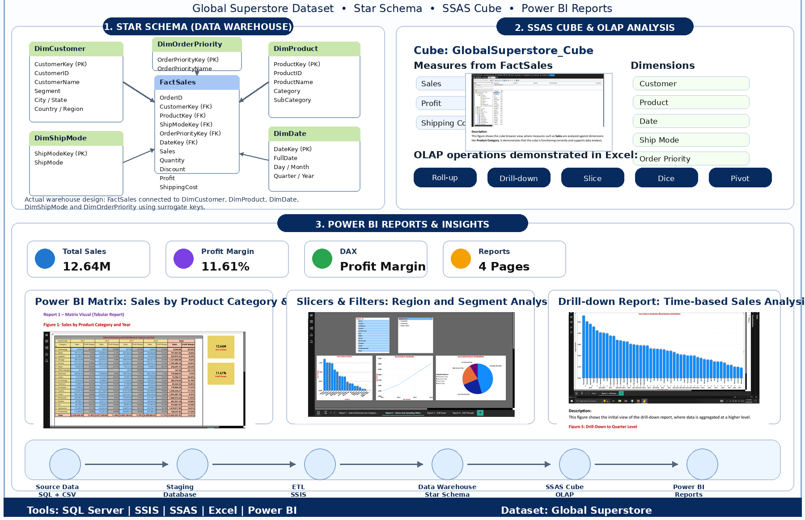

# Data Warehouse and Power BI Dashboard Project

## Project Overview

This project was completed as part of the Data Warehousing and Business Intelligence module. It demonstrates the development of an end-to-end Business Intelligence solution using data warehousing, ETL, cube analysis, Microsoft Excel, and Power BI.

The project uses Global Superstore data to organize, analyze, and visualize business information for better decision-making.

## Project Objective

The main objective of this project was to design and implement a Business Intelligence solution that supports:

- Data integration and preparation
- Dimensional data modelling
- Data warehouse development
- Multidimensional cube analysis
- Excel-based reporting
- Interactive Power BI dashboard development
- Data-driven business decision-making

## Project Workflow

**Source Data → Data Cleaning and Preparation → ETL Process → Data Warehouse → Cube Development → Excel Analysis → Power BI Dashboard**

## Tools and Technologies

- Microsoft SQL Server
- SQL Server Integration Services concepts
- SQL Server Analysis Services concepts
- Data Warehousing
- ETL
- Dimensional Modelling
- Cube Analysis
- Microsoft Excel
- Microsoft Power BI
- Business Intelligence Reporting

## Project Components

### 1. Data Warehouse and ETL

- Prepared and transformed the source data
- Applied ETL concepts to extract, transform, and load data
- Designed a dimensional data model
- Organized the data for reporting and analysis

### 2. Cube Development

- Developed a multidimensional cube solution
- Created dimensions and measures for analysis
- Supported summarized and detailed business reporting
- Applied cube-based analytical techniques

### 3. Excel Analysis

- Used Microsoft Excel for analytical reporting
- Performed filtering, summarization, and comparison
- Analyzed important business measures
- Created structured report views

### 4. Power BI Dashboard

- Developed an interactive Power BI dashboard
- Used charts, cards, filters, and slicers
- Presented key business performance information
- Designed the dashboard to support business decision-making

## Dashboard Preview

## Repository Files

| File | Description |
|---|---|
| `DWBI.png` | Preview image of the Power BI dashboard |
| `DWBI_Assignment2.xlsx` | Excel-based data analysis and reporting |
| `DWBI_Assignment2_IT23815032.pbix` | Interactive Power BI dashboard file |
| `DWBI_Full_Project_Report.pdf` | Complete project report and documentation |
| `GlobalSuperstore_ETL.slnx` | ETL solution file |
| `GlobalSuperstore_Cube.slnx` | Multidimensional cube solution file |
| `README.md` | Project overview and documentation |

## Skills Demonstrated

- Data warehouse design
- ETL concepts
- Data preparation
- Dimensional modelling
- Cube development
- Multidimensional analysis
- Microsoft Excel reporting
- Power BI dashboard development
- Data visualization
- Business Intelligence reporting
- Analytical problem-solving

## How to Explore the Project

1. View `DWBI.png` to preview the Power BI dashboard.
2. Open `DWBI_Full_Project_Report.pdf` to read the complete project documentation.
3. Open `DWBI_Assignment2_IT23815032.pbix` using Microsoft Power BI Desktop.
4. Open `DWBI_Assignment2.xlsx` using Microsoft Excel.
5. Open the ETL and Cube solution files using a compatible Microsoft development environment.

## Academic Note

This project was developed for academic purposes as part of the Data Warehousing and Business Intelligence module.

Some source datasets, database connection details, and configuration files may not be included because of privacy, file-size, or academic restrictions.

## Author

**Dinithi Uthpala**

BSc (Hons) Information Technology Undergraduate  
Specializing in Data Science  
Sri Lanka Institute of Information Technology

- **GitHub:** [dinithi-uthpala](https://github.com/dinithi-uthpala)
- **LinkedIn:** [N. H. D. Uthpala](https://linkedin.com/in/n-h-d-uthpala-275a543a4)
